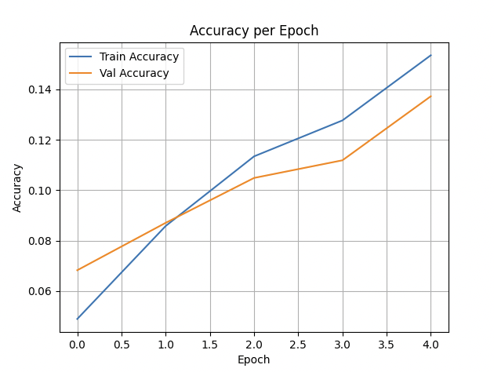

# Demo Cifar

After run python

```
python demo.py
```

```
$ python examples/main.py
/Users/antoniothomacelli/base/lib/python3.9/site-packages/urllib3/__init__.py:35: NotOpenSSLWarning: urllib3 v2 only supports OpenSSL 1.1.1+, currently the 'ssl' module is compiled with 'LibreSSL 2.8.3'. See: https://github.com/urllib3/urllib3/issues/3020
  warnings.warn(
2025-04-10 13:39:02.598612: I metal_plugin/src/device/metal_device.cc:1154] Metal device set to: Apple M3 Max
2025-04-10 13:39:02.598644: I metal_plugin/src/device/metal_device.cc:296] systemMemory: 128.00 GB
2025-04-10 13:39:02.598649: I metal_plugin/src/device/metal_device.cc:313] maxCacheSize: 48.00 GB
2025-04-10 13:39:02.598664: I tensorflow/core/common_runtime/pluggable_device/pluggable_device_factory.cc:305] Could not identify NUMA node of platform GPU ID 0, defaulting to 0. Your kernel may not have been built with NUMA support.
2025-04-10 13:39:02.598673: I tensorflow/core/common_runtime/pluggable_device/pluggable_device_factory.cc:271] Created TensorFlow device (/job:localhost/replica:0/task:0/device:GPU:0 with 0 MB memory) -> physical PluggableDevice (device: 0, name: METAL, pci bus id: <undefined>)
Epoch 1/5
2025-04-10 13:39:08.723615: I tensorflow/core/grappler/optimizers/custom_graph_optimizer_registry.cc:117] Plugin optimizer for device_type GPU is enabled.
782/782 ━━━━━━━━━━━━━━━━━━━━ 506s 627ms/step - accuracy: 0.0322 - loss: 4.6186 - val_accuracy: 0.0683 - val_loss: 4.1236
Epoch 2/5
782/782 ━━━━━━━━━━━━━━━━━━━━ 478s 611ms/step - accuracy: 0.0811 - loss: 4.0704 - val_accuracy: 0.0871 - val_loss: 4.1005
Epoch 3/5
782/782 ━━━━━━━━━━━━━━━━━━━━ 478s 611ms/step - accuracy: 0.1073 - loss: 3.8566 - val_accuracy: 0.1049 - val_loss: 4.2606
Epoch 4/5
782/782 ━━━━━━━━━━━━━━━━━━━━ 485s 621ms/step - accuracy: 0.1266 - loss: 3.7339 - val_accuracy: 0.1119 - val_loss: 4.3047
Epoch 5/5
782/782 ━━━━━━━━━━━━━━━━━━━━ 488s 624ms/step - accuracy: 0.1500 - loss: 3.5588 - val_accuracy: 0.1373 - val_loss: 4.0537
History keys: dict_keys(['accuracy', 'loss', 'val_accuracy', 'val_loss'])
Train Accuracy: [0.048980001360177994, 0.08584000170230865, 0.1134599968791008, 0.12771999835968018, 0.15355999767780304]
Val Accuracy: [0.06830000132322311, 0.08709999918937683, 0.10490000247955322, 0.11190000176429749, 0.13729999959468842]
```

You will see a window like this:


